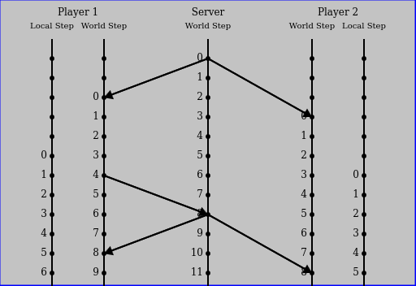

TODO: send keyboard input on every frame
      server needs a way to reject old inputs

bendTo(state, step):
    where step is in the future
    on each update bend the object some amount so that it has exactly the future state
    when the step index aligns
    this is just bending, but don't apply inputs until a specific step is hit
    percent is the number of bending steps away

9/7/23: for moving platforms send a message that the player collided and the relative offset
        snap the server to the position and bend for other players
        {type: csp-object-input, "snap": entid, offsetx, offsety}

        require specific message for bending instead of delaying an input
        csp-object-bend
            step: the step when bending should finish
            payload: {state}
        if the current step is less then step: start bending
        the platformer requires customization of bending targets

        THIS might be the same as server side collisions where the state needs to be broadcasted
            and blended over multiple steps instead of delayed by input_delay
            this might have the benefit of not requiring custom bending of targets
        this is handled automatically by the existing framework by using reconciliation

9/2/23 2:40: next plan is to send event with lag compensation
    instead of an input delay of 6
    the input delay is max(6, RTT/2)
    then just use simple bending
    debug: when 1-way latency is < 50 ms, there should not be  significant mis predictions

When we do server-side collision detection, we need to rewind all other players’ position by network latency + interpolation delay, otherwise the collision detection will not be correct.


* TODO: is there a way to calculate an error budget per entity
  in the x and y direction compute the error.
  fix the error when velocity is negative to the error
  bend when the error is to great

# Client-Server Game Architecture

This is a guide on how to implement a Client-Server Game architecture with
Client Side Prediction, Interpolation, Extrapolation, and Lag Compensation on the Server.
This guide assumes that you have already read these articles:

  * [Gabriel Gambetta: Client-Server Game Architecture](https://www.gabrielgambetta.com/client-server-game-architecture.html)
  * [Gaffer On Games: Networked Physics](https://gafferongames.com/post/networked_physics_2004/)
  * [Valve Multiplayer Networking](https://developer.valvesoftware.com/wiki/Source_Multiplayer_Networking)

  * 0fps Replication in Networked Games
    [Part 1](https://0fps.net/2014/02/10/replication-in-networked-games-overview-part-1/)
    [Part 2](https://0fps.net/2014/02/17/replication-in-networked-games-latency-part-2/)
    [Part 3](https://0fps.net/2014/02/26/replication-in-networked-games-spacetime-consistency-part-3/)
    [Part 4](https://0fps.net/2014/03/09/replication-in-network-games-bandwidth-part-4/)
  * How Do Multiplayer games sync their state
    [Part 1](https://medium.com/@qingweilim/how-do-multiplayer-games-sync-their-state-part-1-ab72d6a54043)
    [Part 2](https://medium.com/@qingweilim/how-do-multiplayer-game-sync-their-state-part-2-d746fa303950)
  * [Client-side Prediction for Smooth Multiplayer Gameplay](https://kinematicsoup.com/news/2017/5/30/multiplayerprediction)
  * [Speed limit of Ping](https://www.pingdom.com/blog/theoretical-vs-real-world-speed-limit-of-ping/)
  * https://news.ycombinator.com/item?id=26020594
  * https://gamedev.stackexchange.com/questions/136166/client-side-prediction-physics
  * https://webdva.github.io/how-i-implemented-client-side-linear-interpolation/



There are many different ways to implement a Client-Server Game Architecture. Depending on whether
you are building a table top turn based game, or an RTS, or an FPS, the exact features that need to be
implemented will change. This guide focuses on real time simulation, closer to that found in a FPS.
The architecture can be summarized as the following (adapted from Gabriel Gambetta):

  * Client connects and receives a full sync from the server
  * Server sends periodic sync messages to all connected clients
    * Clients use these to synchronize a clock
  * Clients send inputs to the server, with time stamps
    * the client simulates the inputs locally
  * Server process inputs and updats the world status
    * changes are included in the sync messages
  * Client processes the sync messages
    * syncs predicted state to the known state
    * interpolates known past state to the next state
    * extrapolates while waiting for the next state

From a player’s point of view, this has two important consequences:
  * Player sees himself in the present
  * Player sees other entities in the past


## Intro

Categories of high speed action games [source](https://www.gamedev.net/forums/topic/695550-client-side-prediction-and-server-sync/):

  1. **"Counter-strike model"**: Place the server entity back into the frame that the client should have seen it in when it shot.
  1. **"Quake Model"**: Run the hit detection on the server, and require that players "lead" their shots.
  1. **"Client Authoritative"**: Accept the hit determination done on the client. (Mainly usable on consoles, because PCs are too open to cheating, also useable in peer-to-peer)


## interactive demos

1. Synchronized Clock

    Displays three panels representing two players and the server.
    The server has a clock which ticks upwards.
    Highlights the fact that clients are viewing the world in the past.

    TODO: add a pause button

2. fireworks
    allow changing latency only
    only uses the object create message

3. movement
    basic top down adventure style movement system
    allow changing latency only

    uses object create and object input message

4. moving platform
    basic collision detection, physics
    include an elevator platform
    wheel only, up to jump, down to duck
    allow changing latency only
    uses object create and object input message

5. lag compensation
    player1 or player 2 have a button to be ai controlled
    players are space invaders ships pointed at each other
    and can only move left or right
    players have a button to shoot a bullet

demo features
    adjust latency between client<->server
    adjust input delay (constant at 6 normally)
    adjust % packet loss (webrtc is reliable)

ltmps = 3.33564e-9
299792458 meters per second
0.29979245800000004
0.0006671280012458482

## 0) Notes On Latency


Network Latency is the delay from sending and receiving a packet of data.
To calculate latency the time from sending a packet, and the receiving
the reply from the server is measured. This gives the round trip time (RTT)
The latency in one direction can be estimated to be half of the RTT, as there
is no guarantee the packet took the same route from the client to the server, as
from the server to the client.

The speed of light is roughly 1/3rd of a meter per nanosecond.
Latency is not just the speed of electricity through the wires.
If that were the case the RTT from Boston to New York City would be on the order of 1ms.
Passing through various switches and routers increases the time it takes for
the packet to be sent.

The reality is that the time for a packet to travel from Boston to New York City
is closer to 8ms. This is close to half of the frame time at 60FPS. If this held
true in reality, every input could be sent to the server on every frame allowing the
client and server to be in lock step synchronization.

However every packet is not created equally. Network congestion among other things
can slow down some packets. Some packets may take 2x the amount of time, others
may take 10x as long to travel the distance.

Latency follows something like a [poisson distribution](https://en.wikipedia.org/wiki/Poisson_distribution).
Where most packets arrive somewhere close to the minimum time, but there is a long unbounded maximum time.


latency

there is a minimum delay between the server and the client.
add up the distance for each hop and and any delay constants for each switch along the way
model jitter as a minimum + a poisson random number
model jitter as a random variable `(max_delay)*x^2`
This biases the packet latency to be closer to the target latency
(half of the packets will have a latency of `target_latency+maxdelay/4` or less)


## 1) Synchronized Clock

The first step in implementing a fast paced multiplayer server is to
have clocks synchronized between the client and the server.

The server side of the code is very simple. Every 100 milliseconds
send a message to all connected clients the current value of the local step.


server:
```typescript

class Server {

    constructor() {
        this.timer = 0.1
    }

    update(dt: float) {
        this.local_step += 1
        this.timer -= dt // subtract the delta since the last update
        if (this.timer < 0) { // check if the timer expired
            // send a message to all connected clients
            this.broadcast({type: "sync", step: this.local_step})
            this.timer += 0.1 // add 100ms to the timer
        }
    }

}

```

the client side is more tricky.
The client has a world step and a local step. Both are incremented
by one on every update step.

When the client receives the sync message, it updates the world step
to be the maximum of the receive value and the current value.

On every update, the client can compare the world step and the local step, and will
take action to try and synchronize the values. The values could be completely out of sync,
from a temporary network disconnect, in which case the client may request a full resync from the server
If the client is only a few frames behind, it may choose to run two updates in a row.
if the client is a few frames ahead, it may choose to skip an update.

This ensure that the client is synchronized with the server, but doesn't
take in to account lag in the network. to solve that, the client delays
inputs by 100ms. If the game is running at 60 ticks per second, then
the client local step should always be behind the world step by 6 steps.

```typescript
onSyncMessage(msg) {
    this.world_step = max(msg.step, this.world_step)
}

update(dt: float) {
    const delta = this.world_step - this.local_step
    const step_delay = 6
    if (delta > step_delay) {
        this.step()
        this.step()
    } else if (delta == step_delay) {
        this.step()
    } // else skip an update
}
```

This approach works well enough or a demo, but in practice, is a terrible way to implement this.
a better way would be to temporarily increase or decrease the framerate until the clocks are
synchronized again. Implementing some hysteresis to smooth out changes will also help, as
getting desynchronized by +/- one frame will be normal.

## 2) Receiving messages


A ring buffer data structure is easy to build out of a fixed length array

```typescript

    class Ringbuffer {
        constructor(capacity, fill_callback) {
            this.data = Array.from({length: capacity}, fill_callback)
            this.capacity = capacity
            this.fill_callback = fill_callback
        }

        get(step) {
            return this.data[step%this.capacity]
        }

        set(step, value) {
            this.data[step%this.capacity]
        }

        clear(step) {
            this.set(step, this.fill_callback())
        }
    }


```

The size of the ringbuffer depends on how much history we want to keep, and the amount of
lead time we want to store messages before processing. If the server is sending updates
every 100ms at 60FPS, then an array size of 60 is enough for storing the last second of events.
The game will delay applying inputs for 100 ms, so needs at least 6 frames to store look ahead.

Rules for accessing data in a ringbuffer

- On every step clear the the index at `(local_step - capacity/2) % capacity`
  - this allows for reusing the index for future values
- If the new input is has a step value outside the range from `local_step - history_size` to `local_step + buffer_size`, reject the message
  - two many rejections may indicate a full re sync is needed

The ring buffer structure that we need for Client Side Prediction is one that stores the Entity Id and list of messages for each frame index.
```javascript

    let messages = Ringbuffer(120, () => {})
    if (!(msg.entId in messages.get(local_step))) {
        messages.get(local_step)[msg.entId] = []
    }
    messages.get(local_step)[msg.entId].push(msg)

```

1. Map Sync (full, partial, fragmentation)
2. Object Create
3. Object Input
4. Object Destroy

We don't need an explicit 'Reject Message'. Instead if the message is rejected
the server will send a new partial sync which will update the offending client

## 3) rest of the owl

Unfortunately, Multiplayer game development is a bit like drawing an owl. First draw two circles
stacked on top of each other, one a little longer than the other. Then draw the owl. QED. After
implementing a synchronized clock, there are a number of features that will need to be implemented
for smooth gameplay. The next few sections cover these topics:

  1. Reconciliation - the process of handing late arriving messages
  2. Full Synchronization - sending the current state when a player connects
  3. Partial Synchronization
  4. Object Bending - the process of synchronizing predictions with authoritative state
  5. Resync

every section
- highlevel explanation of topic
- problems that are trying to be solved

interpolation
    by sending only the user inputs and delaying by 100ms
    interpolate using past inputs, aka dead reckoning

## 3.1) Reconciliation

what happens if a message arrives late
You lined up a shot, the enemy is in your cross hairs, and you pull the trigger. But the message
for the player indicating they dodged out of the way is 1 frame late.

Reconciliation is a process where the game state is rewound to apply late messages.
All steps are then run in sequence, to catch back up with the current time.

implement get/set state for the entity

implement get/set state for the world
the state is a dictionary mapping ObjectId => {object, state}

update_before
    pop input
    apply all input received for this step
update
update_after
    save state

## 3.2) Full Synchronization

a) full sync

a) when a player joins mid way through, they will need to be sent the entire state of the game
b) do to floating point rounding errors, deltas will need to be periodically sent to clients

partial syncs are one solution to players with high ping
packets may be dropped because they are too old. the sync will update the client
to a known good starting point for applying new inputs.
the other possible solution is to make the receive buffer larger,
but this means reconciliation will need to be done over a larger window.
partial syncs reduce how many steps are needed for worst case reconciliation

partial syncs only need to be done for the same set of objects where bending could be used
bending may be disabled on the server

## 3.3) Partial Synchronization

server receives a message
    mutate the message
        step: current server local step
        client_step: original step as received for estimating lag compensation later

the game engine is meant to be implemented where only user inputs are sent
from the client to the server, then replicated to neighbors
but due to floating point rounding issues, the clients may need to
re-synchronize from time to time.

How to implement partial synchronization can be a bit of an art.

1. every 100ms the server sends the full state of all objects which received
   input from a client, or moved on the server.
2. every 100ms the server sends the x/y position of all objects that moved.
   clients verify if the position is correct, and then request full syncs
   for only the objects that are out of sync

After the server processes an input, it sends the updated state of modified objects to all clients.

remember that map-sync message implemented in step 1, and updated in step 2.3?

server is authoritative
so even if a future event comes in that is valid, causes a reconciliation
the next partial sync that is sent out is the truth
there is no contradiction

in a perfect world, partial syncs are not necessary. this is not that world
- packet loss
- floating point rounding errors
- cheaters and client side bugs: players may need to snap back to where the server says they are, if an input is rejected

are partial syncs position only?

### Delta Compression

To reduce bandwidth

## 3.4) Bending

Bending is a process where the client prediction is synchronized with the authoritative server state over a number of frames.
This prevents the object from snapping to the correct position.
New messages are applied to objects during reconciliation, which may cause
entities to snap into the correct position. This can be quite jarring to a player as it looks
like objects are teleporting all over the screen.

Instead of applying messages directly to an entity during reconciliation,
the message are applied to a shadow copy. Then when reconciliation is completed
the shadow copy and the real object are gradually synchronized over a number of steps

- when a message is received that could trigger a reconciliation, keep track of the object id.
- once reconciliation begins create shadow copies of all dirty entities.
- if an object would be created during reconciliation, create a shadow copy as well
- during reconciliation apply inputs to entities. If the entity has a shadow, apply it to the shadow only
- When reconciliation ends, bend the object and its shadow over a number of steps

For simple objects bending can be a straight interpolation between the object and it's shadow.
For more complicated objects, that model not just speed, but acceleration it can be more tricky.
Regardless of the complexity, when bending finished the object should have
exactly the same state as the shadow object.

There isnt a one size fits all solution to bending. Every object
will need to implement its own rules for how to interpolate between two states.

things to consider
    - object creation and deletion looks funny when bent
    - inputs that alter trajectory should be bent

TODO: how to bend velocity and acceleration. (answer: the derivative should be smooth: https://en.wikipedia.org/wiki/Jerk_(physics))

next steps

* TODO: bending easing functions
* TODO: configurable bending steps
* TODO: bend newly created objects between their created position and their real time position this would create non -linear velocity issues for bullets, but can be solved in onBend

## 3.5) Resync

If a client is sufficiently out of sync, trying to catch up to the server may not be feasible.
The client can request a full sync from the server and fully refresh the game state.

For browser based games, the browser may not render if the tab is not in focus. When the user
switches back to that tab, the game will be out of sync.

## 3.6) Server Side Collisions

- rewind to the collision frame
- apply all new inputs since
- bend client position to the new position over a number of frames

## 4) Reconnect

playerId vs sessionId

the first time a client connects the server can reply with a sessionId
If the client ever disconnects, the client can send the last sessionId it had
and attempt to reconnect to the old session.
the server should check that the same IP is trying to connect to the session

## 7) delta syncs

## 6) Optimize Serialization

The simulator used to build the example games is cheating in a major way. It uses 4 lists as queues to
pass javascript objects between the 'clients' and the 'server'. In a real world game the objects
will need to be serialized for messages to be sent over the network. Serializing javascript objects
as JSON can take up a lot of space. Games with a large number of objects will quickly fill
up the available bandwidth.

As a rule of thumb individual packets should be under 1400 bytes, whether sent by TCP or UDP.
Theoretically WebRTC supports even larger packet sizes, but it is still best to keep packets small.
Packets over 1500 bytes are often dropped by certain kinds of networks.

Some options to reduce message size

- uses lists over dictionaries to represent object state. a list of ints can be serialized into a smaller payload than an object.
  - `[1,2]` vs `{x: 1, y:2}`
- use bjson, msgpack, or protobuf instead of JSON.stringify/JSON.load
- use zlib compression

## 7) Lag compensation

The server knows at what time each message was received, and can estimate the latency for each client.
This information can be used to rewind the state to what a particular player was actually seeing
at a specific point in time.

clients should send a special object-input message with a lag compensation flag
the message indicates that the server should perform lag compensation when processing
the message
e.g. if its a collision, look at the state history for the two characters

## 10) other notes

split axertc_client in axertc_client and axertc_daedalus_client

the server can kill an object
clients can process damage, but should wait for the server to indicate an object actually died.

metric: number of updates per second
        ideally 1 update : 1 frame
        with reconciliation, it can be much more
        only reconcile on even frames?

metric: number of bytes incoming and outgoing per player
        query param to display this information
        use JSON.stringify and count
        for illustrative purposes pushing towards msgpack or something

demo client

two CspMaps, side by side
mock client
individual latency sliders for each side
client holds on to messages in an incoming queue, moves them to an outgoing queue

the passive replication article implies sending the inputs to the server
which applies them in real time and replicates them to the clients.
this implies that while the clock is synchronized, the inputs are not synchronized
and that deltas will need to be sent out to all clients

passive replication could potentially solve the jump bug and the bullet bug,
as the player will end up jumping or firing the gun when the other player receives the message

in passive replication, on  the server, when not running reconciliation,
record the entities that receive input,are created, or are destroyed. for every step
in update_after send the updated state for each object to all clients
v1: full state
v2: position only
v3: deltas only

partial syncs apply to the cached world state, so that future reconciliation will be correct


https://gamedev.net/forums/topic/579104-interpolation-vs-client-side-prediction/4692250/

Interpolation for proxies, ie. objects not controlled by the player, is fairly straight forward and it sounds like you've got it covered.

Predicting controlled objects is hairier; This is how I do it.

At T6 the client receives state T4 from server. It takes state T4 and applies all input entered during T5 and T6 to arrive at state P6.
This is what's rendered on the screen (unless we use the technique below).

At T7 the client receives state T5 from server. It takes state T5 and applies all input entered during T7 and T7 to arrive at state P7.

Unfortunately, it turns out that on the server, the player collided with a newly spawned object. This was (of course) not part of our prediction, so a visible SNAP will occur between P6 and P7.

To remedy this, the client will at T7 ALSO keep predicting from T4 (the old server state), applying input from T5, T6 and T7 to arrive at P7v2.

Using both P7 and P7v2 we can interpolate for a short period of time between our old prediction and our new (better) prediction, to avoid snapping and instead smoothly going from misprediction to correct prediction.