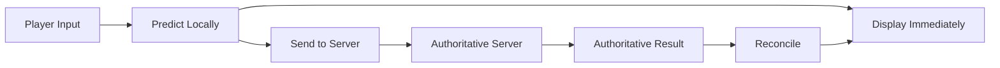
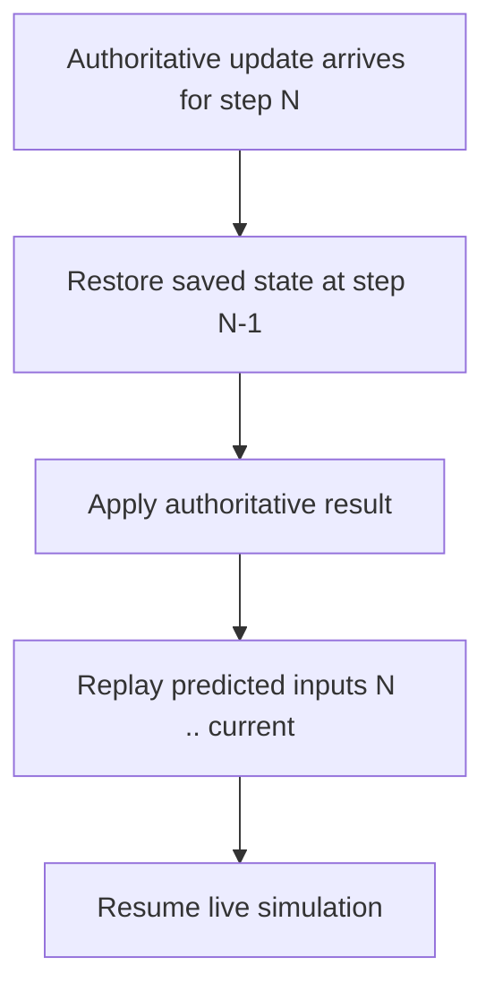

# Client-Side Prediction (CSP) — `csp.js`

## Overview

`csp.js` implements a **client-side prediction and server reconciliation** system for a real-time multiplayer game. It allows clients to immediately apply player input locally (without waiting for server confirmation), then correct any divergence from the authoritative server state through reconciliation and smooth visual "bending".

Reference: [Gabriel Gambetta's CSP series](https://www.gabrielgambetta.com/client-side-prediction-server-reconciliation.html)

---

## Architecture

```
┌────────────────────────────────────────────────────┐
│ ClientCspMap                                       │
│  - receives network messages                       │
│  - drives clock sync (NORMAL / SKIP / CATCHUP)    │
│  - wraps CspMap                                    │
└────────────────────┬───────────────────────────────┘
                     │
┌────────────────────▼───────────────────────────────┐
│ CspMap  (shared client + server simulation core)   │
│  - inputqueue   (circular buffer)                  │
│  - statequeue   (circular buffer)                  │
│  - objects      (live entity dictionary)           │
│  - receiveEvent / handleMessage / reconcile        │
└────────────────────────────────────────────────────┘
                     │
┌────────────────────▼───────────────────────────────┐
│ ServerCspMap                                       │
│  - receives messages from players                  │
│  - rewrites step numbers to server time            │
│  - broadcasts echoed inputs back to all clients    │
│  - sends periodic map-sync heartbeats              │
└────────────────────────────────────────────────────┘
```

---

## Exported Classes

### `Entity`

Base class that every game object must extend.

| Method | Signature | Description |
|---|---|---|
| `paint` | `(ctx)` | Render the entity |
| `update` | `(dt)` | Advance simulation by one tick |
| `onInput` | `(payload)` | Apply an input payload to this entity |
| `getState` | `()` → `object` | Return serialisable state snapshot |
| `setState` | `(state)` | Restore from a snapshot |
| `onBend` | `(progress, shadow)` | Interpolate toward the shadow copy; default snaps immediately |
| `bendTo` | `(state, world_step?)` | Create a shadow copy and start bending |
| `destroy` | `()` | Remove from the world |

**Internal fields set by `CspMap`**

| Field | Type | Description |
|---|---|---|
| `entid` | `string` | Unique entity identifier |
| `active` | `boolean` | Skipped during `update_main` when false |
| `_classname` | `string` | Registered class name string |
| `_shadow` | `Entity \| undefined` | Shadow (authoritative) copy used during bending |
| `_shadow_step` | `number` | Frames elapsed since shadow was created |
| `_server_shadow` | `Entity \| undefined` | Shadow driven by server's partial-sync state |
| `_isShadow` | `boolean` | True on shadow copies |
| `_x_debug_map` | `CspMap` | Back-reference to the owning map |
| `_x_last_input_step` | `number` | Last `local_step` at which an input was applied |
| `_server_latency` | `number` | Computed server round-trip latency in steps |

---

### `CspMap`

The simulation core. Runs identically on client and server. Subclass this for each game map.

#### Constructor settings

| Field | Default | Description |
|---|---|---|
| `isServer` | `false` | Disables bending on the server |
| `playerId` | `"null"` | The local player's ID |
| `settings.enable_bending` | `true` | Interpolate instead of snapping on reconcile |
| `settings.bending_steps` | `6` | Steps over which bending completes (hard-coded to 15 in the loop) |
| `enable_partial_sync` | `true` | Reserved; not yet implemented |
| `step_rate` | `120` | Circular buffer size (steps); = 2 seconds at 60 fps |
| `input_delay` | `6` | Frames a local event is scheduled ahead |

#### Key methods

| Method | Description |
|---|---|
| `receiveEvent(msg)` | **Main client entry point.** Queues an incoming event into `inputqueue` and marks `dirty_step` if the event is in the past. |
| `handleMessage(msg, reconcile)` | Dispatches `msg` to the registered handler for `msg.type`. |
| `reconcile()` | Rewinds to `dirty_step - 1`, replays inputs forward, and restores visual state. Call after all network messages are processed each frame. |
| `update(dt, reconcile?)` | Runs `update_before` → `update_main` → `update_after`. |
| `update_before(dt, reconcile)` | Advances `local_step`, clears the oldest buffer slot, applies queued inputs. |
| `update_main(dt, reconcile)` | Calls `obj.update(dt)` on all active objects; drives shadow bending. |
| `update_after(dt, reconcile)` | Snapshots the current world state into `statequeue`. |
| `getState()` | Returns a full world snapshot (`{[entId]: {obj, state}}`). |
| `setState(state)` | Restores the world from a snapshot. |
| `registerClass(className, ctor)` | Register an `Entity` subclass so it can be created by name from network events. |
| `createObject(entId, className, props, initial_state?)` | Instantiate and register an entity. |
| `destroyObject(entId)` | Remove an entity from the world. |
| `queryObjects(query)` | Filter `objects` by `className`, `instanceof`, `instancein`, or any property value. |
| `sendObjectInputEvent(entid, payload)` | Create and queue a `csp-object-input` event; sends to server if client. |
| `sendObjectCreateEvent(className, props)` | Create and queue a `csp-object-create` event. |
| `sendObjectDestroyEvent(entid)` | Create and queue a `csp-object-destroy` event. |
| `sendObjectBendEvent(entid, state)` | Broadcast a `csp-object-bend` event (server only in practice). |
| `addCustomEvent(eventName, cbk)` | Register a handler `cbk(msg, reconcile)` for a custom event type. |
| `acceptsEvent(etype)` | Returns `true` if a handler is registered for `etype`. |

---

### `ClientCspMap`

Wraps `CspMap` for the client. Handles network message ingestion and clock synchronisation.

```js
const client = new ClientCspMap(new MyGameMap())
client.setPlayerId(playerId)
client.receiveMessage(networkMsg)   // call for each message received over the network
client.update(dt)                   // call once per animation frame
client.paint(ctx)
```

#### Clock synchronisation

`ClientCspMap.update()` compares `world_step` (the server's last known step) against `map.local_step`:

| Condition | `StepKind` | Action |
|---|---|---|
| `delta > step_delay` | `CATCHUP` | Run two simulation steps this frame |
| `delta < step_delay` | `SKIP` | Skip this frame's simulation step |
| otherwise | `NORMAL` | Run one simulation step |

`step_delay` default: **6 frames**.

#### Full sync handling (`map-sync` with `sync: 1`)

On the first `map-sync` or when a full sync is received, the client:
1. Clears all objects.
2. Re-creates each entity from `msg.objects[entId].{className, state}`.
3. Snapshots the world into `statequeue`.
4. Forces `reconcile()` to replay from that point.

---

### `ServerCspMap`

Wraps `CspMap` for the server. Receives messages from players, rewrites their step numbers to the server clock, and broadcasts the results.

```js
const server = new ServerCspMap(new MyGameMap())
server.receiveMessage(playerId, networkMsg)  // call for each message from a player
server.update(dt)                           // call once per server tick
server.join(playerId)                       // send full sync to a newly connected player
```

Every 100 ms (`sync_timer`) it broadcasts a heartbeat:
```js
{ type: "map-sync", uid, step: local_step, sync: 0 }
```

Every 6 steps, it sends `csp-object-bend` for any entity that received an input in the last 6 steps (server-side bending).

---

## Data Types

### Event / Message

All events share a common envelope. The fields present depend on `type`.

```js
{
  type:        string,   // event type (see table below)
  step:        number,   // simulation step at which to apply the event
  entid:       string,   // entity ID (absent for map-level events)
  uid:         number,   // monotonically increasing per-sender unique ID
  payload:     object,   // event-specific data (see per-type tables)
  state:       object,   // entity state snapshot (bend events)
  client_step: number,   // original client step, added by server on rewrite
  bend:        boolean,  // if true, start a bend before queuing
  _x_debug_t:  number    // performance.now() at send time (debug only)
}
```

### Built-in Event Types

| `type` | Direction | `entid` | `payload` / extra fields | Description |
|---|---|---|---|---|
| `csp-object-create` | S→C, C→S | new entity ID | `{className: string, props: object}` | Create an entity |
| `csp-object-input` | C→S→C | target entity | game-defined input object | Apply player input |
| `csp-object-destroy` | S→C, C→S | target entity | — | Destroy an entity |
| `csp-object-bend` | S→C | target entity | `state: object` | Force a bending correction |
| `map-sync` | S→C | — | `sync: 0\|1`, `step`, `objects?` | Heartbeat (0) or full sync (1) |
| `csp-client-settings` | S→C | — | `settings: object` | Push server settings to client |
| `csp-client-connect` | C→S | — | — | Client announces connection |

### `map-sync` Full Sync Payload (`sync: 1`)

```js
{
  type: "map-sync",
  uid: number,
  step: number,
  sync: 1,
  objects: {
    [entId: string]: {
      className: string,
      state: object       // entity-specific, defined by Entity.getState()
    }
  }
}
```

### World State Snapshot (`getState` / `setState`)

```js
{
  [entId: string]: {
    obj:   Entity,   // live object reference (not serialisable over the wire)
    state: object    // entity-specific state from Entity.getState()
  }
}
```

### Outgoing Message Envelope

Written to `map.outgoing_messages` for the transport layer to drain.

```js
{
  kind:     MessageKind.DIRECT | NEIGHBORS | BROADCAST,
  playerId: string,   // recipient (DIRECT) or sender (BROADCAST)
  message:  object    // the event to deliver
}
```

### Circular Buffer Layout

| Buffer | Size | Index key | Value type |
|---|---|---|---|
| `inputqueue` | `step_rate * 2` | `step % capacity` | `{[entid]: {[uid]: event}}` |
| `statequeue` | `step_rate * 2` | `step % capacity` | World state snapshot or `null` |
| `partialstatequeue` | `step_rate * 2` | `step % capacity` | `{[entid]: partial state}` |

---

## Client-Side Processing: Step-by-Step

### Per-frame flow (client)

```
ClientCspMap.update(dt)
  1. Drain incoming_message queue
     - map-sync sync:1  → full world reset + reconcile
     - map-sync sync:0  → update world_step
     - csp-object-create/destroy/bend → map.receiveEvent(msg)
     - csp-object-input
         • if uid in waiting_validation → server echo of own input; validate & discard
         • else                         → map.receiveEvent(msg)  (other players' inputs)

  2. map.reconcile()
     - if dirty_step is set:
         a. Restore statequeue[dirty_step - 1]
         b. Create shadow copies of dirty_objects
         c. Replay _apply() + update_main() from dirty_step → local_step
         d. After each step, restore the incorrect visual state from statequeue
            so the shadow holds the "wrong" position and the real object bends
         e. Re-snapshot each replayed step into statequeue

  3. Clock correction (every 4th frame)
     - delta = world_step - local_step
     - delta > step_delay → CATCHUP (two simulation steps)
     - delta < step_delay → SKIP   (zero simulation steps)

  4. map.update_before(dt)   → advance local_step, _apply() inputs
     map.update_main(dt)     → update entities, advance shadow bending
     map.update_after(dt)    → snapshot world into statequeue
```

### Bending lifecycle

```
reconcile() marks entity as dirty
  → shadow copy created with last-known-good state
  → real object keeps its visually displayed (possibly wrong) state

Each frame (update_main):
  shadow.update(dt)           ← shadow simulates the authoritative timeline
  progress = shadow_step / 15
  entity.onBend(progress, shadow)   ← entity blends toward shadow

After 15 frames:
  entity.setState(shadow.getState())
  shadow deleted
```

### Local input flow

```
game calls map.sendObjectInputEvent(entid, payload)
  → event = { type:"csp-object-input", step: local_step + input_delay, entid, uid, payload }
  → map.receiveEvent(event)          ← applied locally immediately (prediction)
  → waiting_validation[uid] = event  ← stash; remove when server echoes back
  → map.sendMessage(playerId, event) ← queued for network transport
```

---

## Entity ID Convention

| Origin | Format | Example |
|---|---|---|
| Server-created | `"s" + uid` | `"s42"` |
| Client-created | `playerId + "-" + uid` | `"player1-7"` |

---

## `queryObjects` Query Format

```js
// All players
map.queryObjects({ className: "Player" })

// All solid objects (using instanceof)
map.queryObjects({ instanceof: SolidBase })

// Objects that are instances of any listed class
map.queryObjects({ instancein: [Rock, Wall] })

// Objects with a specific property value
map.queryObjects({ team: "red" })

// Objects that have a property (any value)
map.queryObjects({ breakable: undefined })
```

---

## Known Limitations / TODOs (from source)

- Bending step count is hard-coded to **15** inside `update_main`, overriding `settings.bending_steps`.
- `enable_partial_sync` flag exists but partial sync is not implemented.
- "Just kidding" events (late-arriving inputs that reverse a death) are acknowledged as a known problem; the server is authoritative once a death has been broadcast.
- Reconciliation that starts before the oldest cached input throws an error.
- `setState` does not reconstruct objects from scratch; it relies on live object references surviving the snapshot.

---

## What Is Broken and What Should Be Fixed

### 1. Bending progress value is constant — smooth interpolation never happens

**Location:** `CspMap.update_main`

```js
let _steps = 15
const p = ((obj._shadow_step < _steps) ?
    (1/_steps) :                           // always 0.067 for steps 0–14
    ((obj._shadow_step-_steps)/_steps));   // dead code — shadow deleted before this runs
obj.onBend(p, obj._shadow)
if (obj._shadow_step >= _steps) {
    obj.setState(obj._shadow.getState())
    delete obj._shadow
}
```

`p` is `1/15 ≈ 0.067` for all 15 frames. The second branch is unreachable because the shadow is deleted when `_shadow_step >= _steps`. The value never progresses from 0→1, so `onBend(progress, shadow)` always receives the same constant weight. Any entity that uses `progress` as a lerp factor will blend by 1/15 every frame unconditionally — not smoothly decelerating — and the default `Entity.onBend` snaps immediately regardless because it ignores `progress`.

**Fix:** The progress value should increase linearly from 0 to 1 over `_steps` frames:

```js
const p = obj._shadow_step / _steps   // 0 → 1 over the bending window
```

Also wire `settings.bending_steps` instead of the hard-coded literal.

---

### 2. `settings.bending_steps` is never used

**Location:** `CspMap` constructor and `update_main`

The constructor sets `this.settings.bending_steps = 6` but `update_main` ignores it with `let _steps = 15`. There is no way to configure the bending window at runtime.

**Fix:** Replace `let _steps = 15` with `let _steps = this.settings.bending_steps`.

---

### 3. Reconciliation logs a spurious error for every dirty object every step

**Location:** `CspMap.update_main`

```js
if (!reconcile) {
    // bending logic …
} else {
    console.log("error no rec")   // fires whenever reconcile=true AND a shadow exists
}
```

`_stepstate()` calls `update_main(1/60, true)`. Any object that has a shadow will fire this log on every tick of the reconciliation replay loop. In practice this floods the console every time a late input arrives.

**Fix:** Remove the `else` branch entirely. Having a shadow during reconciliation is expected and correct — the shadow is how the authoritative state is tracked while keeping the visual state intact.

---

### 4. Reconcile replay does not apply new inputs to the real object

**Location:** `CspMap._onEventObjectInput`

```js
_onEventObjectInput(msg, reconcile) {
    const ent = this.objects[msg.entid]
    if (!!ent._shadow) {
        ent._shadow.onInput(msg.payload)
        if (!reconcile) {
            ent.onInput(msg.payload)  // skipped when reconcile=true
        }
    } else {
        ent.onInput(msg.payload)
    }
}
```

During reconciliation, if a shadow exists, the late-arriving input is applied **only to the shadow**, not the real object. The real object is subsequently restored from the old statequeue entry anyway (the visual state), so it ends up two steps wrong instead of one: it missed the new input AND it was reset to an older state. Only the shadow correctly accumulates all inputs.

This is arguably intentional (the real object holds the visual state for bending), but it means the real object is never actually simulated forward with correct inputs during reconcile — it is purely a display artifact until the shadow finishes. Any gameplay logic that runs inside `update()` (collisions, timers, etc.) will be wrong on the visual object for the entire bending window.

**Fix:** Choose one strategy and commit to it:
- **Full snap:** Remove bending entirely. During reconcile, apply all inputs to the real object and snap it to the authoritative state. Simple, no visual smoothing.
- **Separate render/sim objects:** Keep a purely-display copy and a simulation copy. Only the simulation copy participates in game logic. The display copy lerps toward the sim copy. This separates the concerns cleanly and removes the overloaded dual-role of `_shadow`.

---

### 5. `statequeue` after reconciliation holds shadow state, not real-object state

**Location:** `CspMap.reconcile`, inner loop

After replaying each step the loop does:

```js
this._apply(clock, true)
this._stepstate()
// restore visual (wrong) state onto real object
obj.setState(this.statequeue[idx][objId].state)
// snapshot — but getState() returns shadow.getState() when shadow exists
let new_global_state = this._getstate()
this.statequeue[idx] = new_global_state
```

`_getstate()` → `getState()` returns the shadow's state (because `!!obj._shadow` is true). So `statequeue` is overwritten with the shadow's authoritative positions. On the next reconciliation pass those authoritative states are correctly used as starting points — this part works.

However, the visual real-object state is **never** stored in `statequeue` after reconciliation. If a second late input arrives while bending is still in progress, reconcile rewinds to the shadow state (not the visual state), which snaps the visual object backward unexpectedly. The result is visual jitter whenever two reconciliations overlap.

**Fix:** Track visual state and authoritative state in separate queues, or store both per entry in `statequeue` so that a second reconciliation can restore both independently.

---

### 6. Object created during reconciliation has no prior statequeue entry

**Location:** `CspMap.reconcile`, inner bending-restore block

```js
if (!!this.statequeue[idx][objId]) {
    obj.setState(this.statequeue[idx][objId].state)
} else {
    if (!obj._shadow) {
        console.warn(this.instanceId, "warning: missing state info for", objId)
    }
}
```

If a late `csp-object-create` event is replayed during reconciliation, the new entity has no entry in the existing `statequeue[idx]`. It can't be restored to a prior visual state. The code warns and moves on, leaving the object in its freshly-simulated (correct) authoritative state. This is silently inconsistent with all other dirty objects which are reverted to their visual state.

**Fix:** When creating an object during reconciliation, set a flag (`_created_during_reconcile`) so the post-apply restore step skips it intentionally rather than warning. The object should just stay in its simulated state.

---

### 7. Server echoes state at the wrong step number

**Location:** `ServerCspMap.update`, `_x_rewrite_input` path

```js
// 1. Input is received and applied at local_step + 1:
const msg_v2 = {...message, step: this.map.local_step + 1}
this.map.receiveEvent(msg_v2)

// 2. Simulation advances (local_step is now incremented):
this.map.update(dt)

// 3. Echo is broadcast with the post-update local_step:
const msg_v2 = {...msg, step: this.map.local_step}
if (msg.type == "csp-object-input") {
    msg_v2.state = this.map.objects[msg.entid].getState()  // state AFTER update
}
this.map.sendBroadcast(null, msg_v2)
```

The echo carries `state` captured after the update at `local_step`, but `step` in the echo equals `local_step` (which after `map.update` is the step that was just simulated). The state is one simulation tick ahead of the step number in the echo. Clients currently ignore the echoed state (`if (false)` guards the partial-sync code), so this doesn't cause visible bugs today — but it would break any future use of the echoed state for server reconciliation or lag compensation.

**Fix:** Capture the state immediately after `receiveEvent` but before `map.update`, tagged with the correct step number; or document that `msg_v2.state` is the post-step state for `step + 1`.

---

### 8. `validateEvent` calls an undefined method

**Location:** `ServerCspMap.validateEvent`

```js
validateEvent(playerId, message) {
    return this.map.validateMessage(playerId, message) !== false
}
```

`CspMap.validateMessage` is not defined anywhere. Calling `validateEvent` throws `TypeError: this.map.validateMessage is not a function`. The method is currently never called in the live code path (the call site was removed), but its presence is a trap.

**Fix:** Either implement `CspMap.validateMessage(playerId, msg)` (returns `false` to reject, anything else to accept), or remove `validateEvent` entirely.

---

### 9. `sendClientConnectEvent` has the wrong error message

**Location:** `CspMap.sendClientConnectEvent`

```js
if (this.isServer) {
    throw new Error("sendClientConnectEvent not implemented for client")
}
```

The check guards against calling this on a server instance, but the error says "for client". The message is backwards.

**Fix:** Change to `"sendClientConnectEvent not implemented for server"`.

---

### 10. `_x_last_input_step` guard uses `!== null` but the field is `undefined` initially

**Location:** `ServerCspMap.update`, server-side bending

```js
if (ent._x_last_input_step !== null) {
    if (this.map.local_step < ent._x_last_input_step + 6) { … }
}
```

`_x_last_input_step` is never initialised on `Entity`. Before any input is received, it is `undefined`. In JavaScript `undefined !== null` is `true`, so the outer guard passes. The inner condition then evaluates `local_step < undefined + 6` = `local_step < NaN` = `false`, which happens to be safe — but only by accident.

**Fix:** Initialise `_x_last_input_step = null` in `Entity.constructor`, or change the guard to `ent._x_last_input_step != null` (loose equality, which catches both `null` and `undefined`).

---

### 11. `waiting_validation` keyed only on `uid`, which is not globally unique

**Location:** `ClientCspMap.update`, `csp-object-input` handling

```js
if (msg.uid in this.map.waiting_validation) { … }
```

`uid` is a per-`CspMap` counter. When the server rewrites and echoes back a message from another client, that message also carries a `uid` that started from 1 on that other client. If two clients happen to be at the same `uid` value, the echo from client B can accidentally validate (and discard) client A's pending input.

**Fix:** Key `waiting_validation` on `entid + ":" + uid`, and match on the same compound key when the echo arrives.

---

### 12. Clock correction causes dropped frames every 4th frame regardless of drift

**Location:** `ClientCspMap.update`

```js
if (this.map.local_step % 4 == 0) {
    if (delta > this.step_delay) { step_kind = StepKind.CATCHUP }
    if (delta < this.step_delay) { step_kind = StepKind.SKIP }
}
```

The correction fires on every 4th frame even when the drift is only 1 step. A `SKIP` halts rendering for one frame; a `CATCHUP` runs two full simulation steps in one frame. Both cause visible stuttering at a fixed rhythm (every ~67 ms at 60 fps). The source code itself notes that a better approach is adjusting the logical frame rate.

**Fix:** Instead of skipping or doubling frames, scale the simulation `dt` slightly:
- If `delta > step_delay`: multiply `dt` by `1 + correction_rate` to gradually speed up.
- If `delta < step_delay`: multiply `dt` by `1 - correction_rate` to gradually slow down.
- Apply the correction continuously rather than in discrete jumps on every 4th frame.

---

### 13. `_stepstate()` hardcodes `dt = 1/60` regardless of actual frame rate

**Location:** `CspMap._stepstate`

```js
_stepstate() {
    this.update_main(1.0/60, true)
}
```

During reconciliation the simulation is advanced with a fixed delta of 16.67 ms. If the game runs at a different target rate (30 fps, 120 fps, or variable), reconciliation diverges from the normal simulation and entities end up in the wrong positions after replay.

**Fix:** Store the last `dt` used in `update_main` and pass it into `_stepstate`, or accept `dt` as a parameter and pass it through from `reconcile`.

---

### Summary Table

| # | Symptom | Severity | Effort |
|---|---|---|---|
| 1 | Bending `p` is constant; interpolation is wrong | High | Low |
| 2 | `settings.bending_steps` ignored | Medium | Trivial |
| 3 | Console spam "error no rec" on every reconcile | Medium | Trivial |
| 4 | Real object misses new inputs during reconcile | High | Medium |
| 5 | Second reconcile during bending causes visual snap | High | High |
| 6 | Objects created during reconcile not handled cleanly | Medium | Low |
| 7 | Server echoes state tagged to wrong step | Medium | Low |
| 8 | `validateEvent` calls undefined method | High (crash) | Low |
| 9 | Wrong error message in `sendClientConnectEvent` | Low | Trivial |
| 10 | `_x_last_input_step` guard is accidentally correct | Low | Trivial |
| 11 | `waiting_validation` uid collision across clients | Medium | Low |
| 12 | Frame skip/catchup causes rhythmic stutter | Medium | Medium |
| 13 | `_stepstate` uses hardcoded 60 fps delta | Medium | Low |

---

## Best Practices for Authoritative Multiplayer

This chapter is a conceptual guide to building a responsive game on top of an
authoritative server. It is deliberately implementation-agnostic: the goal is to
explain *why* each technique exists and *when* to reach for it, so that any
concrete networking layer can be evaluated against these principles.

### The Authoritative Server Model

The foundational rule is simple: **the server owns the truth**. Clients never
decide what actually happened in the world; they only *request* actions and
*display* the results. This single constraint defends against an entire class of
cheating (speed hacks, teleporting, rewriting health) and gives you one
canonical timeline to reconcile against.

The tension this creates is latency. If a client had to wait for the server to
confirm every action before showing it, a player with 80 ms of latency would
feel 160 ms of input lag on every key press. The techniques below exist almost
entirely to hide that round-trip while preserving the server's authority.



**Guidelines**
- Treat every message from a client as a *request*, not a fact. Validate it.
- Never trust client-reported position, damage, or timing. Recompute on the server.
- Keep the simulation deterministic. Given the same inputs in the same order, the
  server and every client must produce the same state. Non-determinism (uncontrolled
  random seeds, float drift, iteration-order dependence) makes reconciliation
  impossible to reason about.

### Client-Side Prediction

Client-side prediction means the client runs the *same* simulation the server
runs, and applies the local player's input immediately — before the server has
acknowledged it. The player sees their character move on the very next frame,
and network latency becomes invisible for their own actions.

The mental model: the client is running slightly *ahead* of the server, betting
that its inputs will be accepted. Most of the time that bet is correct, so the
prediction is never visibly wrong.

**Guidelines**
- Predict only what the local player controls. Predicting remote players requires
  extrapolation (guessing their future input), which is far riskier and is better
  handled by interpolation or bending.
- Every predicted input must be *reproducible*. Tag it with a sequence number and
  a target simulation step so the same input can be replayed later during
  reconciliation.
- Keep a rolling history of both the inputs you issued and the world state at each
  step. Prediction is only useful if you can later prove — or correct — it.
- Prediction and reconciliation are a matched pair. If you predict, you must
  reconcile; otherwise the client and server slowly drift apart.

### Server Reconciliation

Reconciliation is how a client corrects itself when the server disagrees. Because
of latency, the server's confirmation of an input arrives several frames after the
client already predicted it. Meanwhile the client has predicted *more* inputs on
top of the first. When the authoritative result finally arrives, the client must:

1. **Rewind** to the last known-authoritative state (the state at, or just before,
   the confirmed step).
2. **Re-apply** the authoritative result from the server.
3. **Replay** every locally-predicted input that came *after* that step, in order,
   fast-forwarding back to the present.

If the prediction was correct, the replay produces exactly what was already on
screen and nothing visibly changes. If it was wrong, the world snaps to the
corrected position — which is where *bending* (below) comes in to hide the snap.



**Guidelines**
- Store enough history. You must be able to rewind at least as far back as your
  worst-case round-trip time. A few seconds of ring-buffered state and input is a
  reasonable default.
- Reconcile from a *saved snapshot*, not from a hand-patched current state.
  Rewinding to a real past state and replaying is far less bug-prone than trying to
  surgically edit the present.
- Reconciliation should be idempotent: running it twice with the same server data
  must yield the same result.
- Beware the "just kidding" problem. The server may broadcast a consequence (e.g.
  a death) that a late-arriving input later invalidates. Design consequences so the
  authoritative server resolves them; clients should be able to *walk back*
  cosmetic effects when reconciliation disagrees, or the server should delay
  irreversible decisions until inputs are final.
- Reconciling on *every* input is expensive. Only reconcile when the server data
  actually contradicts local prediction, or batch server updates and reconcile
  once per received update.

### Bending (Smoothing Corrections)

When reconciliation or a remote-state update disagrees with what's on screen, the
naive fix is to teleport the entity to the correct position. This looks terrible —
players see rubber-banding and jitter. **Bending** (a form of error smoothing)
instead moves the visible entity toward the authoritative position gradually over
several frames, so the correction is felt as a gentle nudge rather than a snap.

A common way to think about it: keep two positions for a corrected entity — the
*authoritative* target and the *displayed* position. Each frame, ease the
displayed position a fraction of the way toward the target until the error is
negligible, then drop the distinction. A "shadow" copy of the entity at the true
state is a convenient way to track the target the visible entity is bending
toward.

**Guidelines**
- Bend the *visual* representation only. The simulation should always continue
  from the authoritative state; bending must never feed back into the physics or
  it will corrupt future prediction.
- Choose a bend duration proportional to the error and the frame rate. Small errors
  should resolve in a handful of frames; very large errors (a genuine teleport, a
  respawn) should snap instantly — bending a huge distance looks worse than
  cutting.
- Bending is a cosmetic lie with a deadline. Always converge fully within a bounded
  number of frames so a stream of small corrections cannot accumulate into
  permanent visible drift.
- The local (predicted) player and remote players often want different bending
  policies. The local player is usually *right* and needs only tiny corrections;
  remote players are being interpolated/extrapolated and may need more aggressive
  smoothing.
- Consider *server-driven* bending for remote entities: the server periodically
  broadcasts authoritative state for recently-active entities, and every client
  bends toward it. This bounds how far any client can drift without a full resync.

#### Client-Side vs Server-Side Bending

"Client-side" and "server-side" bending sound like two competing places to run the
same feature, but they are not. It helps to separate two distinct questions:

1. **Who performs the interpolation** (the frame-by-frame easing of a displayed
   position toward a target)?
2. **Who decides the correction target** (the authoritative state to bend toward)?

The answer to the first question is *always the client*. Bending is a purely
cosmetic operation that only matters to something with a screen. The authoritative
server is the single source of truth that everyone reconciles against; if it ever
smoothed its own simulation, it would corrupt that truth. So the server's own state
stays crisp and exact — **only clients ever interpolate.** In that sense there is no
such thing as the server bending *itself*.

What actually differs is the second question — where the *target* comes from — and
the right answer is split by entity type.

**Client-driven bending (for the locally-controlled player)**

The entity the player controls is predicted locally and corrected through
reconciliation. When a server echo reveals a misprediction, the client computes the
correction itself and bends its own object toward the replayed authoritative state.

- The correction target is produced by `reconcile()`, not received over the wire.
- Mispredictions are usually small and rare, so these bends are tiny and fast.
- The server does **not** need to push bend targets for this entity — the client
  already has everything it needs from reconciliation.

**Server-driven bending (for remote entities)**

A client cannot reliably predict the inputs of *other* players, so it cannot
reconcile them the same way. Instead the server periodically broadcasts the
authoritative state of recently-active entities, and each client bends its copy
toward that state.

- The correction target arrives from the server (e.g. a periodic state broadcast or
  an explicit bend event).
- This bounds drift: however wrong extrapolation gets between updates, every client
  re-converges on the next authoritative broadcast.
- The interpolation itself still runs on the client — the server only supplies the
  target.

**Use both, for different entities**

| Entity | Correction target comes from | Interpolation runs on |
|---|---|---|
| Locally-controlled player | Reconciliation (client computes it) | Client |
| Remote players / entities | Server broadcast / bend event | Client |

Neither strategy is sufficient alone. With only client-driven bending, remote
players rubber-band because there is no authoritative anchor for their motion. With
only server-driven targets, nothing smooths them — you still need the client to
interpolate.

**Pitfall: don't double-correct the owned entity**

The locally-controlled entity should be corrected by reconciliation *only*. If the
server also sends bend events for that same entity, the two correction sources fight
each other every frame: reconciliation predicts the object forward while the server
bend drags it back toward a slightly older authoritative sample, making the character
feel sticky or rubbery under the player's own control. Best practice is to **exclude
each client's owned entity from server-driven bend events** — server-driven bending
is exclusively for the entities a client does *not* own.

### Clock Synchronization

Prediction and reconciliation both assume the client and server agree on *which
simulation step* an input belongs to. But the two clocks never tick in perfect
lockstep: network latency is variable, and even locally the frame rate wobbles
(59 fps one moment, 61 the next) due to CPU scheduling. Clock synchronization is
about mapping a remote timestamp onto the local timeline reliably enough to line
inputs up.

There are two complementary jobs:

1. **Estimating the offset** between a remote clock and the local clock, despite
   jitter. A low-pass filter / exponential moving average turns noisy per-message
   samples into a stable offset estimate.
2. **Maintaining a target lead** so the client stays a fixed number of steps ahead
   of the server — enough that predicted inputs arrive *just before* the server
   needs them, and no earlier.

**Guidelines**
- Add a deliberate **input delay** (buffering local input by a few frames). This
  gives inputs time to reach the server before their scheduled step and dramatically
  reduces how often reconciliation is needed. The cost is a small, *constant* input
  latency, which players tolerate far better than intermittent correction jitter.
- Don't chase the clock. Filter the offset estimate so a single late packet doesn't
  yank the whole timeline.
- Correct drift *smoothly* rather than by hard skips. Two common approaches:
  - **Discrete correction**: occasionally run an extra simulation step (catch up)
    or skip one (slow down). Simple, but can cause a visible hitch.
  - **Continuous correction**: subtly scale the simulation time step (e.g. run at
    an effective 99% or 101% speed) until the clocks realign. Smoother, and
    generally preferred for player-visible entities.
- Never let the local clock run so far ahead that predicted inputs pile up beyond
  your history buffer — that guarantees a failed reconciliation and a full resync.
- Send periodic lightweight heartbeats carrying the server's current step so clients
  can continuously re-anchor their estimate, and reserve full-state resyncs for
  connection setup or unrecoverable divergence.

### How the Pieces Fit Together

These four techniques are not independent features; they form a single pipeline
and depend on each other:

| Technique | Solves | Depends on |
| --- | --- | --- |
| Authoritative server | Cheating, canonical truth | Deterministic simulation |
| Client-side prediction | Local input feels instant | Reproducible, sequenced inputs |
| Server reconciliation | Predictions that turn out wrong | Saved state + input history |
| Bending | Corrections look jarring | Reconciliation producing a target |
| Clock synchronization | Inputs land on the right step | Offset estimation + input delay |

A useful way to sanity-check a design: trace a single key press from the moment
it is pressed, through local prediction and display, across the wire to the
server, back as an authoritative echo, through reconciliation, and finally into a
bend if the prediction was off. If every stage has a clear owner and a bounded
worst case, the netcode will feel responsive *and* stay authoritative.

### Common Pitfalls

- **Non-deterministic simulation.** The single most common cause of "it works on
  my machine" desyncs. Control all randomness and avoid iteration-order and
  float-precision dependence.
- **Unbounded history or unbounded catch-up.** Both let a bad connection spiral
  into an unrecoverable state. Always cap them and fall back to a full resync.
- **Feeding cosmetic corrections back into physics.** Bending is display-only. If
  the smoothed position leaks into the simulation, prediction compounds the error.
- **Reconciling too eagerly.** Reconciling on every packet, even when prediction
  was correct, wastes CPU and can introduce jitter of its own.
- **Trusting client time.** Clients can lie about their clock just as easily as
  their position. The server assigns authoritative step numbers; client timestamps
  are only hints for synchronization.
