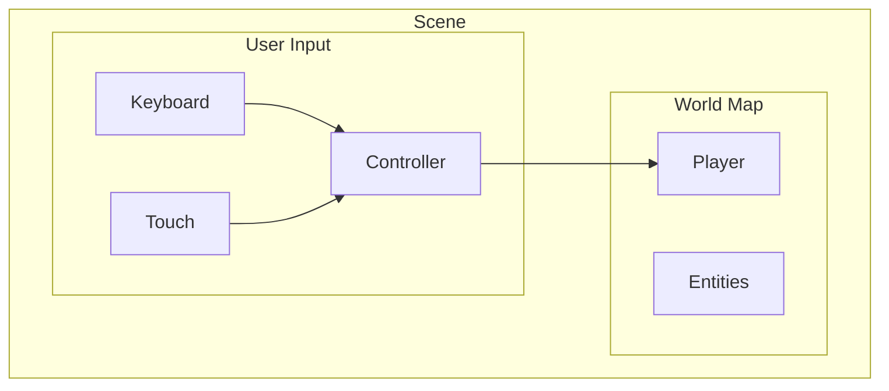
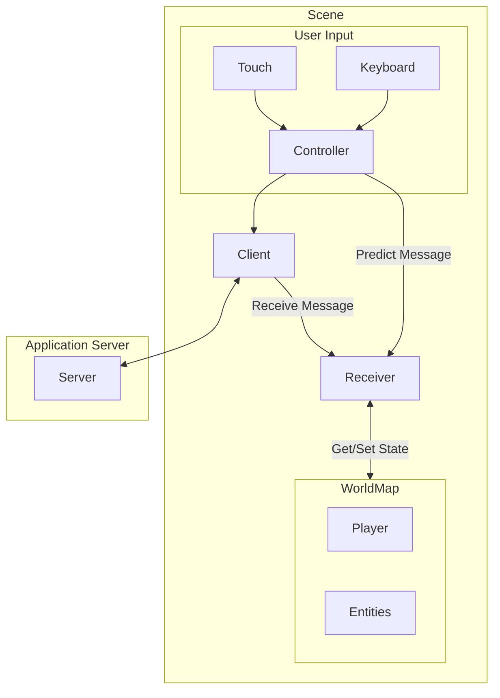

a multiplayer smash brothers clone may have multiple scenes


- title scene
- login
- connect (to game server)
- character select
- main (the main game state)








Offset: make a few assumptions
    - clients are sending updates as fast as possible
    - the internet is a series of tubes
    - the serve is actually validating the client messages before retransmission
    - the client can easily deduplicate incoming messages


## Clock Synchronization

In a multiplayer game you have two or more players sendings messages to a server.
The server validates and sends these messages to the other player.
There are two network hops involved and the latency depends on the quality of the connectiong
for each player.

Both clients are simulating the game at 60 FPS, but how do you keep the clock synchronized
betweent the server and the player. The short answer is to not even bother.

In addition to network latency, other factors effect the clock rate. For example variability
in the CPU scheduling may mean that the game dips down to 59 frames per second for a moment,
and then up to 61 frames per second in the next.

A solution needs to handle all of this latency in an easy to define way.

<details>
  <summary>Exponential Weighted Moving Average</summary>

### References

 - [Exponential Weighted Moving Average](https://en.wikipedia.org/wiki/Exponential_smoothing)
 - [Low Pass Filter](https://en.wikipedia.org/wiki/Low-pass_filter#Simple_infinite_impulse_response_filter)

A Low Pass Filter can be used to compute a running mean for a sampled value.
We can use this to estimate the offset to apply to the frame index of a message received from another player.
The issue with a low pass filter is now we have to pick an $\alpha$ to define the filter

Alpha should be between 0 and 1.
  * when close to zero, dampening of previously seen values is quick
  * when close to one, dampening is slow

The simplest low pass filter is an exponention moving average filter:

$$V_0 = X_0$$

$$\begin{equation}\tag{1}V_n = \alpha*X_n + (1-\alpha) * V_{n-1}\end{equation}$$

Where $\alpha$ is a smoothing factor. $0 < \alpha < 1$.
This can be rewritten into the form:

$$\begin{equation}\tag{2}V_n = V_{n-1} + (1 - a) (X_n - V_{n-1})\end{equation}$$

This form can be useful for estimating a mean, $V_0$ can be initialized to the expected value.
For example, when trying to track the seconds per frame, which should be 1/60.

The cutoff frequency for a filter in this form is defined by:

$$RC=\Delta_T\frac{1-\alpha}{\alpha}$$

$$F_c = \frac{1}{2*\pi*RC} = F_s \frac{1 - \alpha}{\alpha * 2 * \pi}$$

Where $F_c$ is the cutoff frequency and $F_s$ is the sample rate; $0 < F_c < \frac{F_s}{2}$

Solving for alpha gives the following equation

$$\alpha = \frac{F_s}{F_s + 2 \pi F_c}$$

Alternative equation (not sure which book it came from)


$$\alpha = 1 - e^{-\frac{1}{F_s}}$$

Assume messages are sent every 100 milliseconds, $F_s = 10$

Sample Values. All this math and it comes down to picking a value that seems to work well

| $F_s$ | $F_c$   |  $\alpha$    |
| ----- | ------- | ------------ |
| 10 | 0.05 | 0.97    |
| 10 | 0.5  | 0.761   |
| 10 | 0.4  | 0.80    |
| 10 | 1.0  | 0.6141  |
| 10 | 5.0  | 0.2415  |

</details>

The following sample code applies a low pass filter to estimate the difference
between the current players clock and a remote players clock. It then applies an input delay
to that remote player, which is equivalent to the input delay applied to the local player.

```python

    clock: int = ... # increments by one every frame
    intput_delay: int = 6 # 100ms delay in frames-per-second (60 FPS)
    alpha: float = 0.8

    class Message:
        type: str
        clock: int
        origin: int
        payload: Any

    message_offsets: Dict[int,float] = {}

    def updateOffset(message):

        if message.origin not in message_offsets:
            # initialize the offset store
            message_offsets[message.origin] = clock - message.clock
        else:
            # apply equation 2 for the low pass filter
            message_offsets[message.origin] += (1-alpha)*(clock - message.clock)

    def handleMessage(message):
        updateOffset(message)

        clock_delta = round(message_offsets[message.origin])
        local_clock = message.clock + input_delay + clock_delta

        # local_clock can now be used in comparisons with the current players clock.

        ...

```


```
```

The documentation on CSP below will assume for now that a stable connection has been made to a backend server.
That udp packets can be sent and received.

tick rates

set the tick rate to 1/60
frame rate can be whatever
if the frame rate is 30 fps, then there are 2 ticks per frame


unique identifiers
- a unique id is the (entid, inputid)
- clients should be sending messages with an entid
- the entid should always be the entid of the player character
- the inputid should be an increasing number for every message sent
- entid and inputit can be modulo 0xFFFF to keep it within 2 bytes


## Creation, Reproduction, and Death

- creation: hang on to initial state